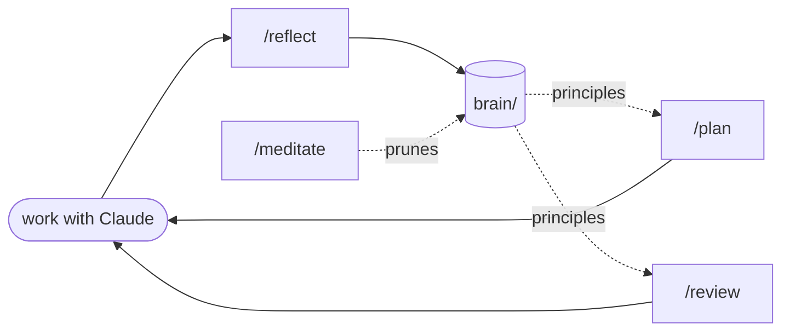

<!--
Vue MAD 2026 -- Madrid.

TRANSITION: Now the talk title...
-->

---

<PartSlide
  title="Clean Code Is Sexy Again"
  subtitle="Making Your Vue Project AI-Ready · Vue MAD 2026 · Alexander Opalic"
/>

---

# About me

<About />

<!--
Quick intro before we get into it.

Alexander Opalic -- Vue 8+ years
Otto Payments -- e-commerce
Blog at alexop.dev -- mostly Vue and AI now

TRANSITION: Now -- here is the world we are shipping into.
-->

---
layout: image
image: /five-levels.png
backgroundSize: contain
---

<div class="absolute bottom-4 right-6 text-xs op-50">
  Framing: Dan Shapiro · <em>The Five Levels: From Spicy Autocomplete to the Software Factory</em> · Jan 2026
</div>

<!--
Dan Shapiro framed this beautifully. Six levels, like driving automation.

L0 spicy autocomplete -- AI as a smarter Stack Overflow.
L1 coding intern -- writes boilerplate, you review every line.
L2 junior dev -- pair programmer, you trade off in real time.
L3 developer -- AI writes most of it, you are the verification bottleneck.
L4 senior dev -- runs unattended, you check the final result.
L5 software factory -- you manage goals, AI defines, ships, fixes.

The question for you: where are you actually sitting?

TRANSITION: For context, here's where I am -- and why.
-->

---

# Two weeks ago: Bun got rewritten in Rust

<div class="flex justify-center">
  
</div>

<!--
Exhibit A for why this talk is hard.

Bun -- one of the most-hyped JS runtimes -- rewritten from Zig to Rust.
1M lines. 10 days. By an agent.

Anthropic owns Bun now. Almost entirely Claude. Near-zero human review. 13k unsafe blocks.
Rust and Zig communities melted down. Reviewers were Claude. Claude flagged a follow-up PR as AI slop.

Triumph or disaster? I don't know yet.
What I know: this is the world we ship into. Major OSS rewritten in two weeks by a machine.
The pace is real. Not slowing down.

TRANSITION: So here is the line everyone keeps repeating.
-->

---
layout: statement
transition: fade-out
---

# "You don't have to write code anymore."

<v-click>

# That's half true.

</v-click>

<v-click>

# Only if your project is built for AI and your devs know what they're doing.

</v-click>

<!--
[wait]

Everyone keeps saying this line.

CLICK -- Half true.

CLICK -- It only works if your codebase lets the agent work.

And in some of my repos it 10x'd me.
In others it produced complete garbage.

Same person. Same agent. Same model.
Different codebases.

TRANSITION: So the question is...
-->

---
transition: fade-out
---

<div class="h-full flex items-center justify-center">
  
</div>

<!--
[hold the silence]

This is the question.
The rest of the talk is the answer.

TRANSITION: Quick intro -- then how we're going to answer that.
-->

---

<PyramidOutline :items="[
  { title: 'What an Agent Actually Is', subtitle: 'A loop, not a magic box' },
  { title: 'Context', subtitle: 'Does it know why things exist?' },
  { title: 'Feedback Loops', subtitle: 'Does it know when it is wrong?' },
  { title: 'Discoverability', subtitle: 'Can the agent find the right code?' },
  { title: 'Future', subtitle: 'The role merge' }
]" />

<!--
Five beats.

Start with what an agent really is.
Then three buckets you can act on Monday -- Context, Feedback, Discoverability.
Close with where this is heading.

TRANSITION: Let's start with what an agent is.
-->

---
transition: fade
---

<PartSlide
  part="1"
  title="What an Agent Actually Is"
  subtitle="A new engineer joining your team"
/>

<!--
[scan room]

Most Vue devs treat agents as magic.
Magic is the wrong mental model.
-->

---

<div class="flex justify-center items-center h-full">


</div>

<!--
That is the whole picture.
Read context. Pick a tool. Run it. Read the result. Repeat.

CLICK -- Bounded by three things.

CLICK -- Context window, tools, ability to verify.
That is it.

CLICK -- The analogy that unlocks everything: a new engineer.
You would not throw a new hire into your worst legacy module
and expect a feature in a week. Same with agents.

TRANSITION: Let me strip the magic. Here is what a tool actually is.
-->

---

# A tool is just a function

```ts
const TOOLS = {
  read: {
    description: 'Read file with line numbers',
    schema: { path: 'string' },
    execute: async (args) => Bun.file(args.path).text()
  },
  bash: {
    description: 'Run a shell command',
    schema: { cmd: 'string' },
    execute: async (args) => $`sh -c ${args.cmd}`.text()
  },
  edit: {
    description: 'Find and replace in file',
    schema: { path: 'string', old: 'string', new: 'string' },
    execute: edit
  }
}
```

<!--
A tool is a function. That is the whole concept.

Name. Description. Schema. The code that runs.

The LLM does not "know" how to read files.
You give it a function called read, you describe what it does,
and you let it call it.

That is the entire mechanism.

TRANSITION: And the loop is even simpler.
-->

---

# The loop is just recursion

```ts
async function agentLoop(messages, systemPrompt) {
  const response = await callApi(messages, systemPrompt, TOOLS)
  const toolResults = await runTools(response.content)

  // No tools called → the agent is done
  if (toolResults.length === 0) return messages

  // Tools called → loop with results appended
  return agentLoop(
    [...messages, response, toolResults],
    systemPrompt
  )
}
```

<!--
And the loop is just recursion.

Call the API. Run whatever tools the model asked for.
Loop again with the results appended to the conversation.

When the model returns no tool calls -- it is done.

That is the entire agent architecture.
Everyone is talking about agents like they are a mystery. They are not.

TRANSITION: So how big is this whole thing?
-->

---
transition: fade-out
---

<div class="h-full flex items-center justify-center">
  
</div>

<!--
[pause]

That is nanocode. I built it to understand Claude Code from the inside.
~350 lines of TypeScript.

CLICK

CLICK

A function that calls itself with the results of the previous call.

Once you see an agent this way, the question stops being
"how does the magic work?"

The question becomes:
why does the same simple loop work brilliantly in one repo
and fall apart in another?

That is what the rest of this talk is about.

TRANSITION: First, the official framing -- then three buckets.
-->

---
transition: fade-out
---

<div class="h-full flex items-center justify-center">
  
</div>

<!--
[reveal beat]

Three buckets. Context, Feedback, Discoverability.
The rest of the talk lives inside these three.
-->

---
layout: statement
transition: fade-out
---

# Clean code isn't nice-to-have anymore.

<!--
[pause before speaking. let it land]

You don't need new patterns for AI.
The patterns you already fight for in code review --
the ones the senior dev keeps insisting on --
those are the patterns that make agents work.

If you have spent years caring about architecture, testability,
naming, separation of concerns --
you have been training for this moment without knowing it.

CLICK
CLICK

A codebase that is hard for humans is hard for agents.
Sprawl, hidden coupling, magical state --
humans hate it. Agents fail at it.

TRANSITION: Concrete. In Vue. Starting with context.
-->

---
transition: fade
---

<PartSlide
  part="2"
  title="Context"
  subtitle="AGENTS.md is the unlock"
/>

<!--
[scan room]

Bucket one. The foundation.
With context we define the structure, how we test, the style guide --
everything a new dev would also need.
Once context is solid, you can ask the agent to add oxlint,
wire up vitest, scaffold the folder layout -- it knows the rules now.
-->

---
layout: image
image: /memento.png
backgroundSize: contain
---

<!--
Claude Code is Leonard from Memento.

Every turn, the context resets.
No long-term memory. No yesterday.

So he tattoos the rules on his body.
He photographs the people he meets.
He writes notes he can trust.

That is AGENTS.md.
The tattoo your agent reads every single turn,
because tomorrow it will not remember today.

TRANSITION: But the tattoo space is finite — and most of it is already used before you write a word.
-->

---
layout: statement
transition: fade-out
---

# Every model has a context window.

<v-click>

# And it works best when it's <em>not</em> full.

</v-click>

<div v-click class="mt-12 max-w-3xl mx-auto">

<Card glow>
<div class="text-sm op-90 text-center">
200k tokens for Claude. 1M with the extended window. Same story everywhere.<br/><br/>
<strong style="color: #ff6bed">The more you stuff in, the worse the model gets.</strong>
</div>
<div class="text-xs op-60 mt-3 text-center">Long-context degradation is real — HumanLayer calls it the "dumb zone".</div>
</Card>

</div>

<!--
The Memento metaphor: no memory between turns.
The Memento reality: even within a turn, the window is finite.

200k tokens at Anthropic. 1M with the extended Opus window.
OpenAI, Gemini, all the same shape -- a budget.

CLICK -- And it works BEST when it's not full.
Models degrade as the window fills. Recall drops. Reasoning slips.
The agent starts confusing files.

This is the "dumb zone" HumanLayer talks about.

TRANSITION: And here is the kicker. The window is not empty when you start.
-->

---

# The window isn't empty when you start

<div class="text-center text-sm op-60 mb-6">Before you type your first prompt, the provider has already loaded:</div>

<div class="grid grid-cols-2 gap-6 max-w-4xl mx-auto">

<Card glow>
<div class="text-xs op-50 mb-2">System prompt</div>
<div class="text-base font-bold mb-2" style="color: #ff6bed">"You are Claude Code…"</div>
<div class="text-sm op-80">Anthropic's instructions: how to behave, what to refuse, how to format. <strong>~9k tokens.</strong></div>
</Card>

<Card glow>
<div class="text-xs op-50 mb-2">Tool definitions</div>
<div class="text-base font-bold mb-2" style="color: #ff6bed">Read, Edit, Bash, Grep…</div>
<div class="text-sm op-80">Every tool's name, JSON schema, and description. <strong>~10k tokens.</strong></div>
</Card>

</div>

<div v-click class="mt-8 text-center text-base">
  Baseline cost: <strong style="color: #ff6bed">~20k tokens before you type a word.</strong>
</div>

<div v-click class="mt-6 text-center text-sm op-70 max-w-3xl mx-auto">
  Everything <em>you</em> add — <code>AGENTS.md</code>, skills, MCP servers, sub-agents — spends from what's left.
</div>

<!--
Every provider does this. OpenAI, Anthropic, Gemini -- same shape.

System prompt -- "You are a helpful coding assistant, here are the rules,
here is how to format, here is what to refuse." ~9k at Anthropic.

Tool definitions -- every tool the harness exposes (Read, Edit, Bash, Grep,
Glob, WebFetch...) gets a name, JSON schema, description. ~10k before you
have done anything.

CLICK -- 20k gone. Your budget is what's LEFT.

CLICK -- And then AGENTS.md, skills, MCP servers, sub-agents -- they all
spend from the SAME pool. That is why a 2000-line AGENTS.md is not just
noise -- it is tokens that could have held real code.

TRANSITION: Don't believe me? Claude Code shows you exactly.
-->

---

# `/context` — see your budget

<div class="text-center text-sm op-60 mb-5">Claude Code ships a slash command that shows exactly what's eating your window.</div>

<Card variant="muted" class="max-w-4xl mx-auto">

<div class="font-mono text-xs op-50 mb-3">> /context</div>

<div class="flex h-8 rounded overflow-hidden mb-1 border border-white/10">
  <div style="width: 32.4%; background: #ff6bed"></div>
  <div style="width: 35.2%; background: #60a5fa"></div>
  <div style="width: 4.6%; background: #a78bfa"></div>
  <div style="width: 5.7%; background: #fb923c"></div>
  <div style="width: 21.7%; background: #fbbf24"></div>
  <div style="width: 0.4%; background: rgba(255,255,255,0.15)"></div>
</div>
<div class="text-center text-xs op-60 mb-5">28k of 1M tokens used — share of the <strong>used</strong> portion</div>

<div class="grid grid-cols-2 gap-x-8 gap-y-2 text-sm">
  <div class="flex items-center gap-3"><span class="w-3 h-3 rounded-sm" style="background: #ff6bed"></span> System prompt <span class="op-50 ml-auto">9.1k <span class="op-50">(0.9%)</span></span></div>
  <div class="flex items-center gap-3"><span class="w-3 h-3 rounded-sm" style="background: #60a5fa"></span> System tools <span class="op-50 ml-auto">9.9k <span class="op-50">(1.0%)</span></span></div>
  <div class="flex items-center gap-3"><span class="w-3 h-3 rounded-sm" style="background: #a78bfa"></span> Custom agents <span class="op-50 ml-auto">1.3k <span class="op-50">(0.1%)</span></span></div>
  <div class="flex items-center gap-3"><span class="w-3 h-3 rounded-sm" style="background: #fb923c"></span> Memory files (AGENTS.md) <span class="op-50 ml-auto">1.6k <span class="op-50">(0.2%)</span></span></div>
  <div class="flex items-center gap-3"><span class="w-3 h-3 rounded-sm" style="background: #fbbf24"></span> Skills <span class="op-50 ml-auto">6.1k <span class="op-50">(0.6%)</span></span></div>
  <div class="flex items-center gap-3"><span class="w-3 h-3 rounded-sm" style="background: rgba(255,255,255,0.15)"></span> Free space <span class="op-50 ml-auto">972k <span class="op-50">(97.2%)</span></span></div>
</div>

</Card>

<div v-click class="mt-6 text-center text-base op-90">
  System prompt + tools = <strong style="color: #ff6bed">~19k tokens</strong> before you typed.<br/>
  Memory files, skills, sub-agents — <strong>all compete for what's left.</strong>
</div>

<!--
Type /context in Claude Code. It draws this.

Read the bar:
- Pink + Blue = system prompt + tools = ~19k. The provider's baseline.
- Yellow = skills = 6k. I had a handful loaded.
- Orange = memory files = AGENTS.md + CLAUDE.md = 1.6k.
- Purple = custom sub-agents.
- White slice = everything else, free.

3% used in this session. Lots of room.

But notice -- skills, memory, sub-agents ALL eat from the same window.
That is why "I'll just add it to AGENTS.md" stops working at scale.
Each addition spends from a shared pool.

CLICK -- 19k spent before you typed. The rest is a budget you have to
spend wisely.

TRANSITION: So how do you spend the budget wisely? Start with AGENTS.md.
-->

---
layout: two-cols-header
---

# AGENTS.md — same file, two philosophies

::left::

<div class="text-xs font-bold mb-2" style="color: rgba(255,255,255,0.6)">BAD — the everything dump</div>

```md
# AGENTS.md

## Project Overview
...50 lines...

## Code Style
...200 lines of formatting rules...

## Architecture Decisions
...150 lines of history...

## Gotchas
...300 lines of edge cases...

## Testing Conventions
...100 lines...
```

<div class="mt-2 text-xs" style="color: #ef4444">
~2000 lines. Half your context gone before any work starts.
</div>

::right::

<div class="text-xs font-bold mb-2" style="color: #ff6bed">GOOD — points at the docs</div>

```md
# AGENTS.md

Run `pnpm lint:fix && pnpm typecheck`
after code changes.

## Stack
Nuxt 4, @nuxt/content v3, @nuxt/ui v3

## Structure
- `app/` — Vue application
- `content/` — Markdown files

## Further reading

**IMPORTANT:** read the relevant doc
below before starting any task.

- `docs/nuxt-content-gotchas.md`
- `docs/testing-strategy.md`
- `docs/SYSTEM_KNOWLEDGE_MAP.md`
```

<div class="mt-2 text-xs" style="color: #ff6bed">
~50 lines. Loads docs only when relevant.
</div>

<div v-click class="absolute bottom-4 left-0 right-0 text-center text-lg">
  Progressive disclosure — <strong style="color: #ff6bed">the right context at the right time.</strong>
</div>

<!--
[breathe]

Two AGENTS.md files. Same goal.

LEFT -- the instinct everyone has on day one.
Dump everything. Style rules ESLint already enforces.
Bug post-mortems. Every gotcha you ever hit.
2000 lines. Half your context window gone before any work starts.
HumanLayer calls this the dumb zone -- the model degrades when context is noisy.

RIGHT -- the version that survives.
ONE LINE for tooling: "Run pnpm lint:fix and pnpm typecheck after changes."
The agent runs the build, reads the error, fixes itself.
That is backpressure -- you stop being the linter.

Then a short stack and structure section.
Then the magic part -- "Further reading" with the IMPORTANT instruction.
The agent loads content-gotchas.md ONLY when touching content.
testing-strategy.md ONLY when writing a test.
That is progressive disclosure -- credit to Lin Yuan and Poteto.

Two filters before a line goes in AGENTS.md:
ONE -- can a tool enforce it? Then don't write prose about it.
TWO -- is it universal, or situational? Situational goes in /docs.

CLICK -- The right context at the right time.

TRANSITION: AGENTS.md is the front door. But the agent has two more
knobs you should know — skills, then hooks. Then we tie all three together.
-->

---

# Skills — recipes the agent opens when triggered

<div class="grid grid-cols-2 gap-8 max-w-5xl mx-auto mt-8">

<div>

<div class="text-xs op-50 mb-2"><code>.claude/skills/reflect/SKILL.md</code></div>

```yaml
---
name: reflect
description: >-
  Reflect on the conversation and update
  the brain. Use when wrapping up, after
  mistakes or corrections.
  Triggers: "reflect", "remember this".
---

# Reflect

Review the conversation and persist
learnings to `brain/`.
…
```

</div>

<div class="text-sm op-80 leading-relaxed">

<div class="text-base font-bold mb-4" style="color: #ff6bed">How it loads</div>

<div class="mb-3"><strong style="color: #ff6bed">1.</strong> At startup, the agent reads only <em>name + description</em>.</div>

<div class="mb-3"><strong style="color: #ff6bed">2.</strong> When your prompt matches, the body loads.</div>

<div class="mb-3"><strong style="color: #ff6bed">3.</strong> Scripts and references load only if the body opens them.</div>

<div class="text-xs op-50 mt-6">Open format. Same <code>SKILL.md</code> runs in Claude Code, Cursor, Codex, Copilot — ~30 agents.</div>

</div>

</div>

<!--
A skill is a named recipe the agent can open when it needs it.
Frontmatter on top -- name + description. Markdown body below.

At startup the agent does NOT load the whole cookbook.
It only sees the menu -- names and one-line descriptions.
Progressive disclosure for actions.

When your prompt matches a description, the body loads.
When the body says "run scripts/extract.py", THEN the script
loads. Three levels of lazy loading -- skills scale.

This is brainmaxxing's /reflect skill -- the actual file from
the repo. End of session, the agent scans the conversation
and distils what mattered back into brain/. You'll see five
more like this in a minute -- /plan, /review, /meditate,
/ruminate, /brain.

Open standard. Same SKILL.md runs in Claude Code, Cursor,
Codex, Copilot -- thirty agents.

And before you write one -- browse skills.sh. Vendors publish theirs.
Vercel's React best-practices. Anthropic's frontend-design.
Free recipes from the platform owners.

TRANSITION: Skills are buttons you press. Hooks fire whether
you press anything or not.
-->

---

# Hooks — code that runs around agent events

<div class="grid grid-cols-2 gap-6 mt-6">

<div>

<div class="text-xs op-50 mb-2"><code>.claude/settings.json</code></div>

```json
{
  "hooks": {
    "SessionStart": [{
      "matcher": "startup|resume",
      "hooks": [{
        "type": "command",
        "command": ".claude/hooks/inject-brain.sh"
      }]
    }]
  }
}
```

<div class="text-xs op-50 mb-2 mt-3"><code>inject-brain.sh</code></div>

```bash
#!/bin/bash
INDEX="$CLAUDE_PROJECT_DIR/brain/index.md"
[ -f "$INDEX" ] && cat "$INDEX"
```

</div>

<div>

<div class="text-base font-bold mb-4" style="color: #ff6bed">When + what fires</div>

```text
session starts
   │
   ▼
SessionStart hook fires
   │   (cats brain/index.md)
   ▼
agent reads it as context
   │
   ▼
first reply is grounded in brain/
```

<Card variant="muted" class="mt-5">
<div class="text-xs op-60 mb-1">Other events</div>
<div class="text-xs op-80"><code>PreToolUse</code> block bad calls · <code>PostToolUse</code> react after writes · <code>UserPromptSubmit</code> rewrite prompts</div>
</Card>

</div>

</div>

<!--
Skills are buttons you press. Hooks fire automatically when
an event happens in the agent loop.

The easiest sentence: when this event happens, run this handler.

LEFT -- the actual brainmaxxing config. SessionStart wires
inject-brain.sh. Every new session, before the agent's first
reply, that script runs.

The script just cats brain/index.md to stdout. Claude Code
captures stdout and prepends it to the conversation as context.
That's the trick -- "before any session, show the agent the map."

You can use the same SessionStart event for anything --
loading env vars, kicking a tunnel, warming a cache.

RIGHT -- the four events you'll actually use:
SessionStart -- inject context, like brainmaxxing does.
PreToolUse -- block destructive Bash, gate writes to certain paths.
PostToolUse -- run lint after edits, rebuild an index after writes.
UserPromptSubmit -- enrich or rewrite the prompt before the model sees it.

Codex got hooks in May 2026. Cursor next. Open pattern now.

TRANSITION: Dozens of events. Don't memorize them. Here's the map.
-->

---
layout: image
image: /claude-code-lifecycle.svg
backgroundSize: contain
---

<!--
You don't need to memorize this.
The point is the surface area — there are dozens of points the harness
will hand you JSON and let you decide what happens next.

The four I use daily are SessionStart, PreToolUse, PostToolUse, UserPromptSubmit.
The rest are there when you need them.

TRANSITION: Skills you call. Hooks fire. Now combine both with a folder. That's brainmaxxing.
-->

---

# `brainmaxxing` — skills + hooks + a `brain/` folder

<div class="text-center text-sm op-60 mb-4">A loop that makes the agent <strong>sharper every session</strong>.</div>



<div v-click class="mt-6 text-center text-sm">
  <code style="color: #ff6bed">"Install brainmaxxing from github.com/poteto/brainmaxxing into this project."</code>
  <div class="text-xs op-50 mt-1">No npm install. Tell Claude. It copies the files and merges <code>settings.json</code>.</div>
</div>

<!--
You just saw skills. You just saw hooks. Brainmaxxing combines both
with one folder: brain/.

Skills do the work.
/reflect WRITES into brain/ -- you saw the SKILL.md.
/plan and /review READ from brain/principles/.
/meditate periodically prunes the vault.

Hooks keep brain/ connected.
SessionStart (the inject-brain.sh you saw) injects brain/index.md.
PostToolUse on brain/ rebuilds the index when notes move.

Result -- a markdown vault that learns. Every session, brain/
gets a little sharper. Next session starts ahead.

CLICK -- the install is wild. No npm. You tell Claude the URL
and the agent does the copying.

TRANSITION: Here is what brain/ actually looks like on disk.
-->

---

# What `brain/` actually looks like

<div class="grid grid-cols-2 gap-6 mt-6">

<Card variant="muted">
<div class="text-xs op-60 mb-2">The vault on disk</div>

```text
brain/
├── codebase/
│   ├── slide-gotchas.md
│   ├── theme-system.md
│   └── …
├── plans/
│   └── roadmap.md
├── principles/
│   ├── fix-root-causes.md
│   ├── prove-it-works.md
│   └── …
└── index.md
```

</Card>

<Card glow>
<div class="text-xs op-60 mb-2"><code>index.md</code> — the only file always loaded</div>

```md
# Brain

## Codebase
- [[codebase/theme-system]]
- [[codebase/slide-gotchas]]

## Plans
- [[plans/roadmap]]

## Principles
- [[principles/fix-root-causes]]
- [[principles/prove-it-works]]
```

</Card>

</div>

<!--
LEFT -- one folder. brain/.
codebase/ -- what THIS repo actually does.
plans/ -- what we are working towards.
principles/ -- coming up next.

RIGHT -- one file. index.md. A list of wikilinks. No content inlined.

The SessionStart hook cats index.md into every conversation.
The agent sees the MAP, not the territory.
When it needs theme details, it follows [[codebase/theme-system]].
When it does not, that file never enters the context window.

Whole vault available. Almost nothing loaded.
That is guard-the-context-window in practice.

TRANSITION: Six skills run on top of this vault.
-->

---
layout: default
---

# Six skills that keep `brain/` alive

<div class="grid grid-cols-3 gap-3 mt-8">

<Card glow>
<div class="text-xs op-50 mb-1"><code>/plan</code></div>
<div class="text-base font-bold mb-1" style="color: #ff6bed">Plan</div>
<div class="text-xs op-80">Phased plan written to <code>brain/plans/</code>. Planning only — no code.</div>
</Card>

<Card glow>
<div class="text-xs op-50 mb-1"><code>/review</code></div>
<div class="text-base font-bold mb-1" style="color: #ff6bed">Review</div>
<div class="text-xs op-80">Critique a PR or plan against <code>brain/principles/</code>. No edits.</div>
</Card>

<Card glow>
<div class="text-xs op-50 mb-1"><code>/reflect</code></div>
<div class="text-base font-bold mb-1" style="color: #ff6bed">Reflect</div>
<div class="text-xs op-80">Distil session learnings back into <code>brain/</code>.</div>
</Card>

<Card glow>
<div class="text-xs op-50 mb-1"><code>/meditate</code></div>
<div class="text-base font-bold mb-1" style="color: #ff6bed">Meditate</div>
<div class="text-xs op-80">Audit the vault. Prune stale notes.</div>
</Card>

<Card glow>
<div class="text-xs op-50 mb-1"><code>/ruminate</code></div>
<div class="text-base font-bold mb-1" style="color: #ff6bed">Ruminate</div>
<div class="text-xs op-80">Mine past conversations for missed patterns.</div>
</Card>

<Card glow>
<div class="text-xs op-50 mb-1"><code>/brain</code></div>
<div class="text-base font-bold mb-1" style="color: #ff6bed">Brain</div>
<div class="text-xs op-80">Direct read/write of vault files. The primitive.</div>
</Card>

</div>

<!--
The cards on the previous slide were the boxes. These are the verbs.
Six skills, and each one either reads brain/, writes to brain/, or
cleans brain/. That is the whole game.

Per task:

/plan -- before I touch code on anything bigger than a one-file fix.
It reads brain/principles/, then writes a phased plan to brain/plans/.
Planning only. The plan is the deliverable.

Code. The agent now has a plan grounded in *my* principles, not
generic advice from training data.

/review -- after the code is written. Loads the same principles
fresh, critiques the diff against them. No edits, just the review.

/reflect -- end of session. Did I correct the agent? Did I learn
something new about the codebase? /reflect distils it into brain/
so next session starts ahead of where this one ended.

CLICK

Periodically -- maybe weekly:

/meditate audits the vault. Prunes stale notes. Asks "is this still
true?" of every entry. Cleans the room.

/ruminate goes the other direction -- mines old Claude conversations
for patterns that never made it into brain/. Recovers lost knowledge.

That is the compounding piece. Every loop, brain/ gets a little
sharper. Next session, the agent starts from there.

TRANSITION: And the bonus -- it ships with 16 principles built in.
-->

---

# 16 principles you don't have to write

<div class="grid grid-cols-2 gap-x-8 gap-y-3 max-w-5xl mx-auto mt-6">

<div class="flex items-start gap-3">
  <div class="text-xs font-mono op-40 mt-0.5">01</div>
  <div class="text-sm" style="color: #ff6bed">guard-the-context-window</div>
</div>
<div class="flex items-start gap-3">
  <div class="text-xs font-mono op-40 mt-0.5">02</div>
  <div class="text-sm" style="color: #ff6bed">fix-root-causes</div>
</div>

<div class="flex items-start gap-3">
  <div class="text-xs font-mono op-40 mt-0.5">03</div>
  <div class="text-sm" style="color: #ff6bed">subtract-before-you-add</div>
</div>
<div class="flex items-start gap-3">
  <div class="text-xs font-mono op-40 mt-0.5">04</div>
  <div class="text-sm" style="color: #ff6bed">prove-it-works</div>
</div>

<div class="flex items-start gap-3">
  <div class="text-xs font-mono op-40 mt-0.5">05</div>
  <div class="text-sm op-80">encode-lessons-in-structure</div>
</div>
<div class="flex items-start gap-3">
  <div class="text-xs font-mono op-40 mt-0.5">06</div>
  <div class="text-sm op-80">redesign-from-first-principles</div>
</div>

<div class="flex items-start gap-3">
  <div class="text-xs font-mono op-40 mt-0.5">07</div>
  <div class="text-sm op-80">never-block-on-the-human</div>
</div>
<div class="flex items-start gap-3">
  <div class="text-xs font-mono op-40 mt-0.5">08</div>
  <div class="text-sm op-80">exhaust-the-design-space</div>
</div>

<div class="flex items-start gap-3">
  <div class="text-xs font-mono op-40 mt-0.5">09</div>
  <div class="text-sm op-80">outcome-oriented-execution</div>
</div>
<div class="flex items-start gap-3">
  <div class="text-xs font-mono op-40 mt-0.5">10</div>
  <div class="text-sm op-80">boundary-discipline</div>
</div>

<div class="flex items-start gap-3">
  <div class="text-xs font-mono op-40 mt-0.5">11</div>
  <div class="text-sm op-80">cost-aware-delegation</div>
</div>
<div class="flex items-start gap-3">
  <div class="text-xs font-mono op-40 mt-0.5">12</div>
  <div class="text-sm op-80">foundational-thinking</div>
</div>

<div class="flex items-start gap-3">
  <div class="text-xs font-mono op-40 mt-0.5">13</div>
  <div class="text-sm op-80">experience-first</div>
</div>
<div class="flex items-start gap-3">
  <div class="text-xs font-mono op-40 mt-0.5">14</div>
  <div class="text-sm op-80">make-operations-idempotent</div>
</div>

<div class="flex items-start gap-3">
  <div class="text-xs font-mono op-40 mt-0.5">15</div>
  <div class="text-sm op-80">migrate-callers-then-delete-legacy-apis</div>
</div>
<div class="flex items-start gap-3">
  <div class="text-xs font-mono op-40 mt-0.5">16</div>
  <div class="text-sm op-80">serialize-shared-state-mutations</div>
</div>

</div>

<div v-click class="mt-8 text-center text-sm op-70">
  <strong style="color: #ff6bed">Photograph this slide.</strong>
</div>

<!--
Sixteen principles. Built in.

[scan room]

I am not going to read all of them. I want you to PHOTOGRAPH this slide
and read it on the train home.

But the top four are the ones I lean on every day:

guard-the-context-window -- the whole reason we keep AGENTS.md small.
fix-root-causes -- when the agent ships a bug, fix the factory not the PR.
subtract-before-you-add -- the senior engineer's instinct.
prove-it-works -- if there is no test, it does not work.

These are not novel ideas. They are the things every senior engineer
learned the hard way. brainmaxxing wrote them down for you.

CLICK -- A year of rediscovery. Saved.

This is what my AGENTS.md strategy actually is:
a thin AGENTS.md that points at /docs (progressive disclosure)
plus brainmaxxing's vault + skills + principles underneath.

TRANSITION: But there is one trick that is even bigger.
-->

---
transition: fade-out
---

# Want VueUse-style composables?

<v-click>

# Give the agent VueUse.

</v-click>

<!--
[pause]

Hot take.

Agents are post-trained on READING CODE.
Not reading prose docs.
Stale docs in their training data are noise.
Real source in your tree is signal.

CLICK -- If you want the agent to write like VueUse,
let it READ VueUse.

TRANSITION: One command. Try it tomorrow.
-->

---

# Vendor the library

<div class="text-sm op-60 mb-4">Pull the source into your repo as a git subtree.</div>

```bash
git subtree add --prefix=repos/vueuse \
  https://github.com/vueuse/vueuse main --squash
```

<div class="mt-4 text-sm op-60 mb-2">Then point AGENTS.md at it:</div>

```md
## Reference repositories

- `repos/vueuse/` — when writing new composables, mirror the
  patterns in `repos/vueuse/packages/core/use*/`.
- `repos/pinia/` — store patterns & private-state idioms.
- `repos/nuxt/` — module & plugin conventions.
```

<div class="absolute bottom-4 right-8 text-xs op-40">
Credit: <a href="https://effect.website/blog/the-one-weird-git-trick-that-makes-coding-agents-more-effect-ive/">effect.website — The One Weird Git Trick</a>
</div>

<!--
One command. Vendors VueUse into your repo as a squashed subtree.

Then one line in AGENTS.md: "Mirror these patterns."

That is it.

CLICK

Why a subtree, not a submodule? No clone-time pain.
No "did you forget to init"? Just files.

Why not just point at node_modules? Compiled and flattened --
the structure agents need is gone. And agents are deoptimized
from reading gitignored directories in the first place.

Result -- the agent's pattern matching is now anchored on real code.
Pattern matching beats prompting.

CLICK -- Pro tip. Same trick works for STEALING FEEDBACK LOOPS.
Clone a repo you admire -- npmx.dev is a great Nuxt example.
Ask the agent "how do they test their Nuxt project?"
Copy the approach into your repo. Pattern matching beats reading docs.

I packaged this as a Claude Code skill: clone-repo.
Vendors any repo, wires it into AGENTS.md, done.

Credit where it's due: this whole pattern is from the Effect team's
blog post -- "The One Weird Git Trick That Makes Coding Agents More
Effect-ive" by Maxwell Brown. Read it.

TRANSITION: One more thing -- tune the room so humans don't trip over it.
-->

---

# Tune the room

<div class="text-sm op-60 mb-4">Hide <code>repos/</code> from your editor so auto-imports don't suggest VueUse internals.</div>

<div class="grid grid-cols-2 gap-6">

<div>

```json
// .vscode/settings.json
{
  "typescript.preferences.autoImportFileExcludePatterns": ["repos/**"],
  "files.exclude":        { "repos/**": true },
  "files.watcherExclude": { "repos/**": true },
  "search.exclude":       { "repos/**": true }
}
```

</div>

<div>

<div class="text-sm op-60 mb-2">Then ask the agent to distill it:</div>

```
Read repos/vueuse. Write
agent-patterns/vueuse.md with
the idioms an agent should
follow when writing composables
in this project.
```

<div class="mt-4 text-xs op-60">
A reusable artifact the agent
comes back to — instead of
rediscovering the same patterns
every session.
</div>

</div>

</div>

<!--
Editor side: without this, VSCode happily auto-imports from
repos/vueuse/packages/core/. You ship VueUse internals into your app.
Add these four lines and the editor pretends repos/ does not exist --
but the agent still reads it.

CLICK

Pattern files: once the agent has explored the vendored source,
have it write down what it learned. agent-patterns/vueuse.md.
Next session it loads that instead of re-exploring 800 composables.
Cheaper context. Sharper output.

TRANSITION: Context is the foundation. Now bucket two -- feedback loops.
-->

---
transition: fade
---

<PartSlide
  part="3"
  title="Feedback Loops"
  subtitle="Backpressure: tests, types, lint"
/>

<!--
[scan room]

Bucket two. If an agent does not know when it broke something,
it will ship whatever compiles.
-->

---

# An agent with a failing test runs in a loop until it's green.

<v-click>

# Without tests, it ships whatever compiles.

</v-click>

<div v-click class="mt-12 text-center text-lg op-80">
Every red check is a signal the agent can chase.<br/>
<span style="color: #ff6bed">The faster the signal, the faster the loop.</span>
</div>

<!--
This is the most important slide in the whole feedback section.

An agent with a failing test loops until it is green.
Without tests, it ships whatever compiles.

CLICK -- Every red check is a signal. Faster signal, faster loop.

The slower your tests, the slower the agent. Keep them fast.

TRANSITION: Let's walk the first 5 layers. Modern frontend tooling.
-->

---

# Layer 1 — Type safety

<div class="text-sm op-60 mb-4">The first lie-detector. Catch the bug before it runs.</div>

<div class="grid grid-cols-2 gap-6">

<div>

```ts
// tsconfig.json
{
  "compilerOptions": {
    "strict": true,
    "noUncheckedIndexedAccess": true,
    "exactOptionalPropertyTypes": true
  }
}
```

</div>

<div>

```ts
// At every untyped boundary
import { z } from "zod"

const User = z.object({
  id: z.string().uuid(),
  email: z.email(),
})

const user = User.parse(await res.json())
```

</div>

</div>

<div v-click class="mt-6 text-center text-base op-80">
TypeScript trusts the types you write.<br/>
<strong style="color: #ff6bed">Zod / Valibot / ArkType check that runtime data still matches.</strong>
</div>

<!--
Layer 1 -- type safety.

Strict tsconfig is non-negotiable.
noUncheckedIndexedAccess and exactOptionalPropertyTypes catch
the bugs the default strict mode lets through.

But types are a compile-time fiction. At every untyped boundary --
fetch responses, route params, env vars, form input --
parse with Zod or Valibot.

CLICK -- TypeScript trusts the types you write. Schemas check
the runtime data actually matches.

With parsing in place, the agent stops reaching for `as`.

TRANSITION: Layer 2 -- lint and format. Fast enough to run on every keystroke.
-->

---

# Layer 2 — Lint & format

<div class="text-sm op-60 mb-4">Oxlint + Oxfmt. Fast enough to run on every keystroke.</div>

<div class="grid grid-cols-2 gap-6">

<Card glow>
<div class="text-xs op-60 mb-1">Oxlint</div>
<div class="text-2xl font-bold mb-2" style="color: #ff6bed">~50× faster</div>
<div class="text-xs op-70">Rust-based. Covers the high-value rules. Pair with ESLint for the long tail.</div>
</Card>

<Card glow>
<div class="text-xs op-60 mb-1">Oxfmt</div>
<div class="text-2xl font-bold mb-2" style="color: #ff6bed">~30× faster</div>
<div class="text-xs op-70">Prettier-compatible defaults. Drop-in replacement.</div>
</Card>

</div>

<div v-click class="mt-6">

```bash
# Vite+ wraps both behind one CLI
vp check     # type + lint + format
vp test      # vitest
vp build     # rolldown
```

</div>

<!--
Layer 2 -- lint and format.

Oxlint is roughly 50x faster than ESLint. Oxfmt 30x faster than Prettier.
That speed matters: lint becomes something you can run on every keystroke,
not something the agent batches at the end.

Oxlint's rule set is smaller than ESLint's, but it covers the high-value cases.
Run it as the fast first pass; keep ESLint for the rules Oxlint doesn't ship yet.

CLICK -- Vite+ is VoidZero's unified toolchain. One CLI, one config,
wraps Vite, Rolldown, Vitest, Oxlint, Oxfmt, Tsdown.

TRANSITION: Layer 3 -- the tests themselves.
-->

---

# Layer 3 — Unit tests

<div class="text-sm op-60 mb-4">Vitest. Watch mode. ESM-native. Same matchers as Jest.</div>

```ts
// formatPrice.test.ts
import { describe, it, expect } from "vitest"
import { formatPrice } from "./formatPrice"

describe("formatPrice", () => {
  it("formats EUR with two decimals", () => {
    expect(formatPrice(1234.5, "EUR")).toBe("€1,234.50")
  })

  it("rounds to nearest cent", () => {
    expect(formatPrice(1.005, "EUR")).toBe("€1.01")
  })
})
```

<div v-click class="mt-6 text-center text-base op-80">
Pure functions, hooks, stores, composables.<br/>
<strong style="color: #ff6bed">The cheapest signal. Most logic lives here.</strong>
</div>

<!--
Layer 3 -- unit tests with Vitest.

Pure functions. Hooks. Stores. Composables.
Anything you can call without mounting a component.

Vitest runs in watch mode while you code, and runs everything in CI.
Aim for high coverage of pure modules. Don't chase coverage on UI glue --
that's what the next two layers are for.

CLICK -- Cheapest signal. Most logic lives here.
The agent gets a green or red within milliseconds of saving.

TRANSITION: Layer 4 -- components, but in a REAL browser.
-->

---

# Layer 4 — Component tests

<div class="text-sm op-60 mb-4">Vitest browser mode. Real Chromium via Playwright. No more jsdom.</div>

```ts
// Button.browser.test.ts
import { render } from "vitest-browser-vue"
import { expect, test } from "vitest"
import Button from "./Button.vue"

test("shows tooltip on hover", async () => {
  const screen = render(Button, { props: { tooltip: "Save" } })
  await screen.getByRole("button").hover()
  await expect.element(screen.getByText("Save")).toBeVisible()
})
```

<div v-click class="mt-6 grid grid-cols-2 gap-4">

<Card glow>
<div class="text-xs op-60 mb-1">Works in browser mode</div>
<div class="text-sm">Hover, focus, layout, intersection observers, scroll.</div>
</Card>

<Card variant="muted">
<div class="text-xs op-60 mb-1">Broken in jsdom</div>
<div class="text-sm">All of the above. Half your CSS. Most pointer events.</div>
</Card>

</div>

<!--
Layer 4 -- component tests in a REAL browser.

The biggest win in 2026. Vitest browser mode runs your component tests
in a real Chromium via Playwright instead of jsdom.

Hover states. Focus. Layout. Intersection observers. Scroll behaviour.
All work as they do in production.

CLICK -- Browser mode handles all the things jsdom faked.
The agent can finally trust that "passes in tests" means
"works in the browser".

TRANSITION: Layer 5 -- mock the network ONCE.
-->

---

# Layer 5 — API mocking

<div class="text-sm op-60 mb-4">MSW. Define handlers once. Use them everywhere.</div>

```ts
// src/mocks/handlers.ts
import { http, HttpResponse } from "msw"

export const handlers = [
  http.get("/api/users/:id", ({ params }) =>
    HttpResponse.json({ id: params.id, email: "ada@example.com" })
  ),
]
```

<div v-click class="mt-6 text-center">

<div class="inline-grid grid-cols-4 gap-3 text-xs">
  <Card glow><div class="font-bold">Vitest</div></Card>
  <Card glow><div class="font-bold">Browser mode</div></Card>
  <Card glow><div class="font-bold">Playwright</div></Card>
  <Card glow><div class="font-bold">Dev server</div></Card>
</div>

<div class="mt-4 text-base op-80">
One source of truth.<br/>
<strong style="color: #ff6bed">Not three drifting fixture folders.</strong>
</div>

</div>

<!--
Layer 5 -- API mocking with MSW.

Hard-coded fixtures go stale. Tests that hit a real backend are flaky.
MSW intercepts at the network layer -- fetch, XHR, GraphQL --
with a service worker in the browser and a request interceptor in Node.

CLICK -- The same handlers run in Vitest, browser mode, Playwright,
AND the dev server. One source of truth. Not three drifting fixture folders.

Pair MSW with Zod schemas at the same boundary and your mocks are
typed AND schema-validated. The agent can't lie to itself about the API shape.

TRANSITION: That's 5 of 15. The rest are on the blog.
-->

---

# 15 layers of feedback

<div class="text-center text-sm op-60 mb-4">You've seen 5. There are 10 more. Every layer is a signal the agent can chase.</div>

<div class="grid grid-cols-[1fr_auto] gap-8 items-center">

<div>
  
</div>

<div class="flex flex-col items-center gap-3">
  
  <div class="text-xs op-70 text-center max-w-44">
    Full breakdown<br/>
    <span style="color: #ff6bed">alexop.dev/posts/<br/>modern-frontend-<br/>quality-pipeline</span>
  </div>
</div>

</div>

<!--
You've seen the first 5: types, lint, unit, component, API mocking.

The other 10: contract testing, E2E, a11y, visual regression, performance,
dead code, i18n drift, preview deploys, AI code review, observability.

Every one is a signal the agent can chase.
The cheap ones at the center run on every save.
The expensive ones at the edge run in CI or prod.

I wrote up the full stack on my blog -- scan the QR for the deep dive.

TRANSITION: All those layers are SIGNALS. You still need a GATE.
-->

---

# The commit-time gate: Lefthook

<div class="text-center text-sm op-60 mb-4">15 layers are signals. <strong>Lefthook is the gate.</strong></div>

```yaml
# lefthook.yml
pre-commit:
  parallel: true
  jobs:
    - run: pnpm oxlint
    - run: pnpm oxfmt --check
    - run: pnpm vue-tsc --build
    - run: pnpm vitest related --run {staged_files}

commit-msg:
  jobs:
    - run: |
        grep -qE '^(feat|fix|chore|refactor|test|docs)(\(.+\))?!?: .+' {1} \
          || (echo "Conventional commit required"; exit 1)
```

<div class="mt-6 grid grid-cols-2 gap-6">

<Card glow>
<div class="text-xs op-60 mb-1">Why Lefthook, not Husky</div>
<div class="text-sm">Parallel jobs. YAML the agent can READ and edit. No shell-script soup.</div>
</Card>

<Card variant="muted">
<div class="text-xs op-60 mb-1">The one rule</div>
<div class="text-sm">No <code>--no-verify</code>. If a hook fails, <strong>fix the underlying issue.</strong></div>
</Card>

</div>

<!--
[pause]

15 layers are signals. Lefthook is the GATE.

Bad code doesn't reach main. Full stop.

Why Lefthook over Husky?
- Parallel jobs out of the box -- oxlint, oxfmt, vue-tsc, vitest related all run together.
- YAML is the format. The AGENT can read and edit lefthook.yml.
  It cannot fight a shell-script soup.

Mirror these same checks in .github/workflows/ci.yml so the gate
holds in CI too.

The one rule: no --no-verify escape hatches. If a hook fails, FIX IT.
The whole point of the gate is that it doesn't open.

TRANSITION: Lefthook is the gate at commit time. Remember the hooks slide? Same primitive, different job.
-->

---
layout: statement
---

# Lefthook is the **gate**. Hooks are the **guards**.

<div v-click class="mt-8 text-base op-80 max-w-3xl mx-auto text-center leading-relaxed">
  You met hooks in Part 2. Same primitive — different job:<br/><br/>
  <strong style="color: #ff6bed">Lefthook</strong> runs at <em>commit time</em>: typecheck, lint, tests, conventional-commit format.<br/>
  <strong style="color: #ff6bed">Agent hooks</strong> run <em>mid-loop</em>: enforce pnpm, protect <code>.nuxt/</code>, block <code>.env</code>, <code>SessionStart</code> orient, <code>PostToolUse</code> oxfmt.
</div>

<div v-click class="mt-8 text-center text-base">
  <span style="color: #ff6bed">Don't blur them.</span> Typecheck/lint/tests belong in Lefthook — not <code>PostToolUse</code>.
</div>

<!--
Quick callback to the hooks slide from Part 2.

Same primitive -- shell script the harness runs around tool calls.
But TWO different jobs:

Lefthook is the GATE at commit time. Heavy stuff -- typecheck,
lint, tests, commit-message format. Runs once when you commit.

Agent hooks run MID-LOOP, around every single tool call. So they
have to be CHEAP. The guards I actually run:
- Enforce pnpm. No npm/yarn slipping into the lockfile.
- Protect generated files. Never hand-edit .nuxt/ or components.d.ts.
- Block .env reads -- including cat/head/jq escape hatches.
- SessionStart orient: print branch, project type, nuxi prepare if stale.
- The one PostToolUse carve-out: oxfmt. Milliseconds. Normalization,
  not feedback.

CLICK -- the trap. Don't put typecheck or tests in PostToolUse.
Drift. Intermediate broken state. Context cost. Slow signals.
That's what Lefthook is for.

Codex got hooks in May 2026. Cursor next. This is the new normal.

TRANSITION: Last bucket -- discoverability. Can the agent find the right code?
-->

---
transition: fade
---

<PartSlide
  part="4"
  title="Discoverability"
  subtitle="One folder = one feature"
/>

<!--
[scan room]

Bucket three. The folder structure is the API the agent uses to read your code.
Once context is in place, the agent can help you carve the structure too.
-->

---

# One folder = one feature

<div class="text-center text-xs op-50 mb-3">Real layout from <code>alexanderop/workoutTracker</code></div>

<div class="grid grid-cols-2 gap-8 mt-2">

<div>

<FolderTree
  root
  title="src/"
  :structure="`src/
  views/
  router/
  components/
  composables/
  lib/
  db/
  stores/
  types/
  features/
    workout/
      components/
      composables/
      utils/
    timers/
      components/
      composables/
    exercises/
    settings/
    templates/`"
/>

</div>

<div class="flex flex-col justify-center gap-4">

<Card variant="muted">
<div class="text-sm op-80">Shared layers stay shared: <code>components</code>, <code>composables</code>, <code>lib</code>, <code>db</code>, <code>stores</code>, <code>types</code>.</div>
</Card>

<Card variant="muted">
<div class="text-sm op-80">Each feature is one folder — <code>workout/</code> alone has 24 components and 7 composables.</div>
</Card>

<Card glow>
<div class="text-sm"><strong style="color: #ff6bed">No <code>workout</code> imports from <code>timers</code>.</strong> The folder boundary <em>is</em> the contract.</div>
</Card>

</div>

</div>

<!--
The big idea, grounded in a real project.

This is the actual src/ layout of my workout tracker.
Ten features under features/. Shared layers above.
Views and router at the top.

The workout feature alone is 24 components and 7 composables.
That used to be 24 components scattered across src/components/workout/
and 7 composables in src/composables/. The agent had to grep across
three folders to find anything related to workouts.

Now workout/ is one folder. timers/ is one folder.
And critically -- workout does NOT import from timers.
If they need to share something, it goes up to lib/ or composables/.

TRANSITION: Let me show you what that wall does to the agent.
-->

---

# Same task, two structures

<div class="text-center text-sm op-60 mb-4">"Add a rest-timer reminder to the active workout" — same agent, same task</div>

<div class="grid grid-cols-2 gap-6">

<div>

<div class="text-xs op-50 mb-2">LEFT — Flat (the old layout)</div>

<FolderTree
  root
  title="src/"
  :structure="`src/
  components/
    workout/
      WorkoutActiveMode.vue
      WorkoutHeader.vue
      WorkoutAmrapView.vue
    settings/
    exercise/
  composables/
    useWorkout.ts
    useWorkoutMode.ts
    useRestTimer.ts
    timers/
      useAmrapTimer.ts
  stores/
    workout.ts`"
/>

</div>

<div>

<div class="text-xs op-50 mb-2">RIGHT — Feature-sliced (today)</div>

<FolderTree
  root
  title="src/"
  :structure="`src/
  features/
    workout/
      components/
        WorkoutActiveMode.vue
        WorkoutHeader.vue
      composables/
        useWorkoutMode.ts
        useWorkoutPersistence.ts
    timers/
      components/
      composables/
    exercises/
    settings/`"
/>

</div>

</div>

<div class="mt-4 grid grid-cols-2 gap-6 text-xs">
  <div class="text-center op-60">workout logic spread across <code>components/</code>, <code>composables/</code>, <code>stores/</code></div>
  <div class="text-center" style="color: #ff6bed"><code>features/workout/</code> is one folder. Cross-feature edges go through <code>lib/</code>.</div>
</div>

<!--
Same app -- my workout tracker -- two snapshots in time.

LEFT is what src/ used to look like.
WorkoutActiveMode in components/workout/.
useWorkoutMode in composables/.
Workout store somewhere else.
A change to "active workout" touches three folders.

RIGHT is the layout today.
features/workout is the unit.
Everything Workout* lives there.
If timers and workout need to share something --
say, the rest-timer state -- it gets lifted to lib/.

TRANSITION: Now watch what the agent does in each.
-->

---

# The agent traces

<div class="grid grid-cols-2 gap-4 mt-2">

<div>

<div class="text-xs font-bold mb-2" style="color: rgba(255,255,255,0.6)">LEFT — flat structure</div>

```text
Grep("workout")              → 80+ hits, 9 folders
Read WorkoutActiveMode.vue   → not the state
Read WorkoutHeader.vue       → wrong file
Grep("useWorkout")           → 30 hits, half tests
Read composables/useWorkout  → found state
Read stores/workout.ts       → found mutations
Read composables/useRest...  → timer coupling?
Edit WorkoutActiveMode.vue
Edit useWorkoutMode.ts
Edit stores/workout.ts
Bash: vitest                 → 90s, 2 fails
Read timers.spec.ts          → coupling via store
Edit useAmrapTimer.ts        → fix coupling
Bash: vitest                 → 90s, green
```

<div class="mt-3 text-center">
  <span class="text-lg font-bold" style="color: #ef4444">12 tool calls · ~3 min</span>
  <div class="text-xs op-60 mt-1">+ one accidental coupling</div>
</div>

</div>

<div>

<div class="text-xs font-bold mb-2" style="color: #ff6bed">RIGHT — modular monolith</div>

```text
Glob("src/features/workout/**") → 31 files
Read features/workout/
     composables/useWorkoutMode.ts
Read features/workout/
     components/WorkoutActiveMode.vue
Edit useWorkoutMode.ts
Edit WorkoutActiveMode.vue
Bash: vitest src/features/workout → 4s, green
```

<div class="mt-3 text-center">
  <span class="text-lg font-bold" style="color: #ff6bed">6 tool calls · ~30 sec</span>
  <div class="text-xs op-60 mt-1">blast radius = one folder</div>
</div>

</div>

</div>

<div v-click class="mt-6 text-center text-lg">
  You didn't make the agent <em>smarter</em>.<br/>
  <strong style="color: #ff6bed">You made the codebase legible.</strong>
</div>

<!--
Walk through LEFT slowly. Let the audience feel the waste.

47 grep hits. The agent reads three files before finding state.
Tests take 90 seconds. Two unrelated tests fail because cart and
checkout share a composable that nobody documented.

Click to RIGHT.

Same task. Six tool calls. Vitest in 4 seconds because we scope it.

CLICK -- The point: you didn't make the agent smarter.
You made the codebase LEGIBLE.

TRANSITION: So what are the actual rules? Let me draw them.
-->

---
transition: fade-out
---

<div class="h-full flex items-center justify-center">
  
</div>

<!--
Three rules. That's it.

ONE -- arrows only point down. lib can't import hooks.
components can't import features. The layer order is fixed.

TWO -- inside features/, siblings can't see each other.
cart cannot import checkout. If they share something,
the shared thing belongs in lib or components, not in
one feature reaching into another.

THREE -- app/ is the only place that sees the whole graph.
That's where wiring happens -- routes, providers, the
shell. Nothing else gets that view.

If you can keep these three rules in your head, the codebase
stays navigable. But you won't -- and the agent definitely won't.
So we make a machine enforce them.

TRANSITION: Here's the machine.
-->

---

# Make the boundary executable

<div class="text-center text-sm op-60 mb-4">A convention is a vibe. A lint rule is a wall.</div>

<div class="max-w-3xl mx-auto">

<div class="text-xs font-bold mb-2" style="color: #ff6bed">ESLint — the real <code>eslint.config.ts</code></div>

```ts {*}{maxHeight:'360px'}
// workoutTracker/eslint.config.ts
{
  name: 'app/feature-boundaries',
  files: ['src/**/*.{ts,vue}'],
  rules: {
    'import-x/no-restricted-paths': ['error', {
      zones: [
        // cross-feature isolation
        { target: './src/features/workout',
          from: './src/features',
          except: ['./workout'] },
        { target: './src/features/timers',
          from: './src/features',
          except: ['./timers'] },
        // ...one per feature

        // shared can't reach into features
        { target: ['./src/components', './src/composables',
                   './src/lib', './src/stores'],
          from: ['./src/features', './src/views'] },
      ],
    }],
  },
}
```

</div>

<div class="mt-4 text-center text-sm op-70">
  Every PR — mine, the agent's — fails CI the moment <strong style="color: #ff6bed">workout reaches into timers.</strong>
</div>

<!--
A convention is a vibe.
A lint rule is a wall.

This is the actual eslint.config.ts in my workout tracker.
import-x/no-restricted-paths. One zone per feature
saying "you can be imported from yourself and nothing else
under features/". Plus the inverse: shared layers cannot
import from features or views.

That is the contract. Every PR -- mine, the agent's --
fails CI the moment workout reaches into timers.

TRANSITION: But what if you have already switched to oxlint?
-->

---

# On oxlint? Write the wall yourself.

<div class="text-center text-sm op-60 mb-4">No <code>no-restricted-paths</code> rule — so generate a JS plugin.</div>

<div class="grid grid-cols-2 gap-6">

<div>

<div class="text-xs font-bold mb-2" style="color: #ff6bed">Prompt the agent</div>

```text {*}{maxHeight:'150px'}
Generate scripts/oxlint-plugin-boundaries.mjs:
 1. Read tsconfig paths.
 2. Classify importer + target by layer.
 3. Block cross-feature imports.
 4. Block upward imports (lib → features).
Wire it via jsPlugins.
```

<div class="text-xs font-bold mt-3 mb-2" style="color: #ff6bed">Wire it: <code>.oxlintrc.json</code></div>

```json
{
  "jsPlugins": [
    "./scripts/oxlint-plugin-boundaries.mjs"
  ],
  "rules": {
    "boundaries/no-cross-feature": "error"
  }
}
```

</div>

<div>

<div class="text-xs font-bold mb-2" style="color: #ff6bed">200 lines later — the agent ships</div>

```js {*}{maxHeight:'340px'}
// scripts/oxlint-plugin-boundaries.mjs
const noCrossFeature = {
  create(context) {
    return {
      ImportDeclaration(node) {
        const from = classify(context.filename)
        const to   = classify(node.source.value)
        if (!allowed(from, to)) {
          context.report({
            node,
            message: `${from.layer} → ${to.layer} forbidden`,
          })
        }
      },
    }
  },
}

export default {
  meta: { name: 'boundaries' },
  rules: { 'no-cross-feature': noCrossFeature },
}
```

</div>

</div>

<div class="mt-4 text-center text-sm op-70">
  The agent wrote the rule. <strong style="color: #ff6bed">Now the rule polices the agent.</strong>
</div>

<!--
If you have already switched to oxlint, you hit a wall:
it does not ship no-restricted-paths.

So I told the agent: generate a custom oxlint JS plugin.

oxlint exposes a JS plugin API. ESLint-compatible visitor
pattern -- create(context) returns node visitors,
context.report flags violations. Export a plugin with rules,
register it under jsPlugins, turn the rule on.

200 lines, one prompt, committed.

The point is the loop, not the linter.
The agent wrote the rule.
Now the rule polices the agent.

TRANSITION: That's the three buckets. Zoom out -- where is this all heading?
-->

---
transition: fade-out
---

# Make the codebase agent-ready

<div class="text-center text-sm op-60 mb-6">Four moves. They compound.</div>

<div class="grid grid-cols-2 gap-4 max-w-5xl mx-auto">

<Card glow>
<div class="text-xs op-50 mb-1">01</div>
<div class="text-base font-bold mb-2" style="color: #ff6bed">Write a real AGENTS.md / CLAUDE.md</div>
<div class="text-sm op-80">Stack, structure, gotchas, conventions. The first file every agent reads — make it earn the context window.</div>
</Card>

<Card glow>
<div class="text-xs op-50 mb-1">02</div>
<div class="text-base font-bold mb-2" style="color: #ff6bed">Brainmaxxing: skills + hooks + brain/</div>
<div class="text-sm op-80">Slash commands for the recipes you repeat. Hooks for the rules you can't trust the model to remember. A <code>brain/</code> vault that compounds.</div>
</Card>

<Card glow>
<div class="text-xs op-50 mb-1">03</div>
<div class="text-base font-bold mb-2" style="color: #ff6bed">Stack feedback loops into the pipeline</div>
<div class="text-sm op-80">Types, lint, unit, component, API mocks, E2E, a11y, visual, perf. Every layer is a signal the agent can chase until it's green.</div>
</Card>

<Card glow>
<div class="text-xs op-50 mb-1">04</div>
<div class="text-base font-bold mb-2" style="color: #ff6bed">Feature-based architecture at scale</div>
<div class="text-sm op-80">One folder = one feature. Executable boundaries via lint rules. The agent traces a vertical slice instead of a horizontal layer cake.</div>
</Card>

</div>

<div v-click class="mt-8 max-w-3xl mx-auto">

<Card variant="muted">
<div class="text-sm op-90 text-center">
A better codebase for agents <strong style="color: #ff6bed">is</strong> a better codebase for humans.<br/>
Discoverability, feedback, context — the same three buckets, all the way down.
</div>
</Card>

</div>

<!--
[breathe]

Recap before we look forward.

ONE -- AGENTS.md. Or CLAUDE.md, same file. Stack, structure, gotchas.
This is the first thing every agent reads. Spend an afternoon on it,
not five minutes. It pays back every prompt for the rest of the project.

TWO -- brainmaxxing. Skills are the recipes you find yourself repeating.
Hooks are the rules you cannot trust the model to remember. brain/ is
the vault that compounds session over session. Together they turn the
agent from a generic assistant into your senior teammate.

THREE -- the quality pipeline. Fifteen layers in mine. You don't need
fifteen on day one. You need MORE than zero. Every layer is a signal
the agent uses to course-correct without you in the loop.

FOUR -- once the codebase grows, feature-based architecture. One folder
per feature. Boundaries enforced by lint, not by hope. The agent traces
a vertical slice and stays in one place.

CLICK

And the punchline -- a better codebase for agents IS a better codebase
for humans. Discoverability. Feedback. Context. Same three buckets all
the way down.

TRANSITION: That's the toolkit. Now -- where is this heading?
-->

---
transition: fade
---

<PartSlide
  title="Where this is heading"
  subtitle="The role merge"
/>

<!--
[breathe] [scan room]

Last act. The bigger picture.
-->

---
layout: statement
transition: fade-out
---

# AFK coding is already here.

<v-click>

# You write the spec. The agent ships the PR. You review.

</v-click>

<!--
[pause]

AFK -- away from keyboard.

You write a spec. Kick off an agent. Walk away.
Come back to a draft PR.
The agent ran tests, hit a failure, fixed itself, ran again,
opened the PR with a summary. You review.

CLICK

The work is no longer "me typing."
The work is "me deciding what should exist,
and reviewing what came back."

TRANSITION: Here is what the loop looks like in practice.
-->

---
layout: image
image: /afk/pipeline.png
backgroundSize: contain
---


<!--
Six phases. HITL at the edges. AFK in the middle.

Spec -- I align with the business. Human in the loop.
Slice -- agent breaks the PRD into vertical sub-tickets.
Ralph loop -- one agent per slice, fresh context every iteration, TDD inside.
Refactor -- a dedicated pass. The step LLMs always skip.
QA -- a QA agent drives the real browser.
Review -- I read the PR. HITL again.

Human judgment at the edges. Agent execution in the middle.
This is the glimpse -- full write-up on my blog if you want the long version.

TRANSITION: The most important thing in this loop is what I do when it goes wrong.
-->

---
layout: statement
transition: fade-out
---

# Agent did it wrong?

<v-click>

# Fix the factory, not the PR.

</v-click>

<div v-click class="mt-12 max-w-3xl mx-auto">

<Card glow>
<div class="text-sm op-90">
A bug isn't a bug. It's a factory defect.<br/><br/>
Don't just patch the PR — <strong style="color: #ff6bed">add the ESLint rule</strong>, <strong style="color: #ff6bed">update AGENTS.md</strong>, <strong style="color: #ff6bed">tighten the slash command</strong>. So the same mistake can't ship next week.
</div>
</Card>

</div>

<div v-click class="mt-6 max-w-3xl mx-auto">

<Card variant="muted">
<div class="text-sm op-80">
The reverse also matters: <strong style="color: #ff6bed">delete rules newer models have outgrown.</strong> A constraint that helped an older model can hold a newer one back.
</div>
<div class="text-xs op-50 mt-3">Anthropic recommends a "meaningful configuration review every three to six months" — <em>How Claude Code works in large codebases</em>.</div>
</Card>

</div>

<!--
[pause]

Here is the part most people miss.

The agent ships a bug.
The instinct is: fix the bug, merge, move on.

CLICK -- The instinct is wrong. Fix the FACTORY.

CLICK -- A bug isn't a bug. It is a factory defect.

Add an ESLint rule that catches that whole class of mistake.
Update AGENTS.md so the convention is written down.
Tighten the slash command or the prompt if that is where it leaked.

The PR fix is one bug. The factory fix prevents the next hundred.

This is the same compounding loop as the three buckets earlier:
discoverability, feedback, context.
Every PR review teaches the factory.

The codebase gets smarter over time. You get more leverage every week.

TRANSITION: Thank you.
-->

---
layout: iframe
url: https://alexanderop.github.io/vue-ink/playground
transition: fade
---

<!--
One more thing before we close -- vue-ink.

A Vue port of Ink, the React library for terminal UIs.
Built mostly AFK, with the loop I just walked you through.
Spec, slice, ralph, refactor, QA, review.

Play with it after the talk -- live playground right here.

TRANSITION: Thank you.
-->

---
layout: end
transition: fade
---

# Thank You!

<div class="flex flex-col items-center gap-6 mt-12">
  
  <div class="text-lg op-80">
    <span style="color: #ff6bed">alexop.dev</span> · <span class="op-70">@alexanderopalic</span>
  </div>
</div>

<!--
[breathe] [look up]

Thank you!

Scan the QR for the blog -- AGENTS.md starter, the quality pipeline write-up,
the AFK loop deep dive, all there.

Come find me to chat. I want to hear what your AGENTS.md looks like.

[pause]
-->
